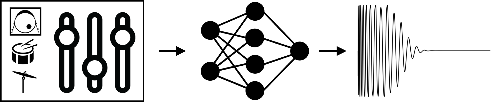
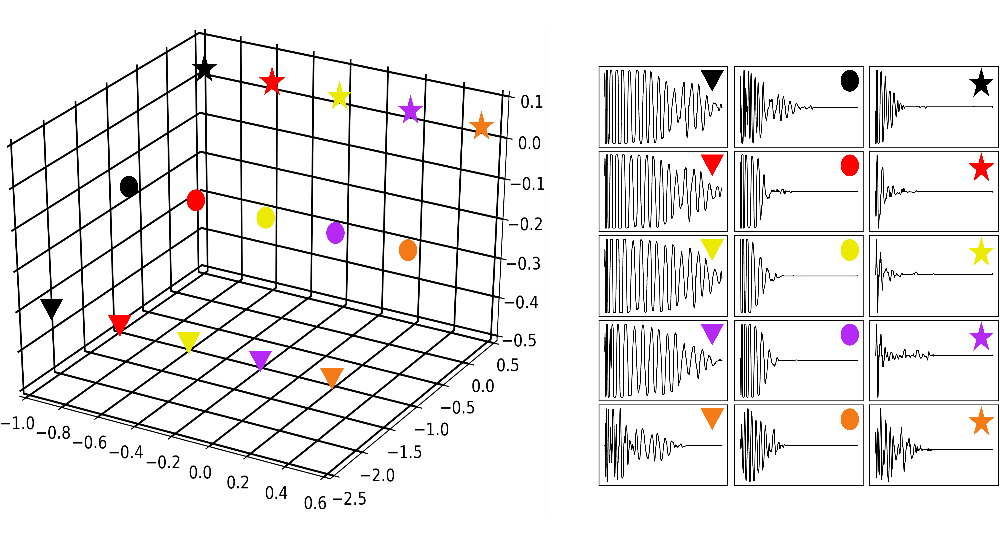

<h3>Audio Examples</h3>

Results accompanying the paper "Adversarial Synthesis of Drum sounds" for the International Conference on Digital Audio Effects 2020

# 

#### Training Data
A random selection of 30 examples from the dataset used in training

<figure>
    <figcaption>Kick drums</figcaption>
    <audio controls
		src="./dafx20_audio/real/realkicks.wav">
	</audio>
</figure>

<figure>
    <figcaption>Snare drums</figcaption>
    <audio controls
		src="./dafx20_audio/real/realsnares.wav">
	</audio>
</figure>

<figure>
    <figcaption>Cymbals</figcaption>
    <audio controls
		src="./dafx20_audio/real/realcymbals.wav">
	</audio>
</figure>

#### Generations
A random selection of 30 examples from the generated data.

<figure>
    <figcaption>Kick drums</figcaption>
    <audio controls
		src="./dafx20_audio/gen/genkicks.wav">
	</audio>
</figure>

<figure>
    <figcaption>Snare drums</figcaption>
    <audio controls
		src="./dafx20_audio/gen/gensnares.wav">
	</audio>
</figure>

<figure>
    <figcaption>Cymbals</figcaption>
    <audio controls
		src="./dafx20_audio/gen/gencymbals.wav">
	</audio>
</figure>

#### Usage demonstration

Example usage within loop-based electronic music compositions. 
The percussive elements of the following tracks were created using a selection
of samples from the generated data. A light amount of post-processing (equalisation and volume envelope shaping)
was applied to mix the sounds.

<figure>
    <figcaption>Track 1: Hip hop demo</figcaption>
    <audio controls
		src="./dafx20_audio/track_demos/hiphopdemo.wav">
	</audio>
</figure>

<figure>
    <figcaption>Track 2: Drum and bass demo</figcaption>
    <audio controls
		src="./dafx20_audio/track_demos/drumandbassdemo.wav">
	</audio>
</figure>

#### Interpolation demonstration

A demonstration showing how sounds can be fine-tuned by interpolating different latent dimensions.
For the following experiments, the GAN was trained with a latent space dimensionality of size 3.

Figure 2: Interpolation in the latent space for kick drum generation. Kick drums are generated for each point along linear 
pathsthrough the latent space (left). Paths are colour coded and subsequent generated audio appears across rows (right).

###### Linear interpolation

<figure>
    <figcaption>Kick drums </figcaption>
    
    <audio controls
		src="./dafx20_audio/interpolation_demos/linear_interpolation/kick_1.wav">
		
	</audio>
	
    <audio controls
		src="./dafx20_audio/interpolation_demos/linear_interpolation/kick_2.wav">
		
	</audio>
	
    <audio controls
		src="./dafx20_audio/interpolation_demos/linear_interpolation/kick_3.wav">
		
	</audio>
	
    <audio controls
		src="./dafx20_audio/interpolation_demos/linear_interpolation/kick_4.wav">
		
	</audio>
	

</figure>

<figure>
    <figcaption>Snare drums </figcaption>
    
    <audio controls
		src="./dafx20_audio/interpolation_demos/linear_interpolation/snare_1.wav">
		
	</audio>
	
    <audio controls
		src="./dafx20_audio/interpolation_demos/linear_interpolation/snare_2.wav">
		
	</audio>
	
    <audio controls
		src="./dafx20_audio/interpolation_demos/linear_interpolation/snare_3.wav">
		
	</audio>
	
    <audio controls
		src="./dafx20_audio/interpolation_demos/linear_interpolation/snare_4.wav">
		
	</audio>
	

</figure>

<figure>
    <figcaption>Cymbals </figcaption>
    
    <audio controls
		src="./dafx20_audio/interpolation_demos/linear_interpolation/cymb_1.wav">
		
	</audio>
	
    <audio controls
		src="./dafx20_audio/interpolation_demos/linear_interpolation/cymb_2.wav">
		
	</audio>
	
    <audio controls
		src="./dafx20_audio/interpolation_demos/linear_interpolation/cymb_3.wav">
		
	</audio>
	
    <audio controls
		src="./dafx20_audio/interpolation_demos/linear_interpolation/cymb_4.wav">
		
	</audio>
	
</figure>

###### Spherical interpolation 

<figure>
    <figcaption>Kick drums </figcaption>
    
    <audio controls
		src="./dafx20_audio/interpolation_demos/spherical_interpolation/kick_1.wav">
		
	</audio>
	
    <audio controls
		src="./dafx20_audio/interpolation_demos/spherical_interpolation/kick_2.wav">
		
	</audio>
	
    <audio controls
		src="./dafx20_audio/interpolation_demos/spherical_interpolation/kick_3.wav">
		
	</audio>
	
    <audio controls
		src="./dafx20_audio/interpolation_demos/spherical_interpolation/kick_4.wav">
		
	</audio>
	

</figure>

<figure>
    <figcaption>Snare drums </figcaption>
    
    <audio controls
		src="./dafx20_audio/interpolation_demos/spherical_interpolation/snare_1.wav">
		
	</audio>
	
    <audio controls
		src="./dafx20_audio/interpolation_demos/spherical_interpolation/snare_2.wav">
		
	</audio>
	
    <audio controls
		src="./dafx20_audio/interpolation_demos/spherical_interpolation/snare_5.wav">
		
	</audio>
	
    <audio controls
		src="./dafx20_audio/interpolation_demos/spherical_interpolation/snare_4.wav">
		
	</audio>
	

</figure>

<figure>
    <figcaption>Cymbals </figcaption>
    
    <audio controls
		src="./dafx20_audio/interpolation_demos/spherical_interpolation/cymb_1.wav">
		
	</audio>
	
    <audio controls
		src="./dafx20_audio/interpolation_demos/spherical_interpolation/cymb_2.wav">
		
	</audio>
	
    <audio controls
		src="./dafx20_audio/interpolation_demos/spherical_interpolation/cymb_3.wav">
		
	</audio>
	
    <audio controls
		src="./dafx20_audio/interpolation_demos/spherical_interpolation/cymb_4.wav">
		
	</audio>
	
</figure>

# 

###### Experimenting with different dimensions

<figure>
    <figcaption>Interpolating the first dimension of the latent space, 
    whilst keeping the second and third dimensions fixed </figcaption>
    <audio controls
		src="./dafx20_audio/interpolation_demos/different_dimensions/moving_1D.wav">
	</audio>
</figure>

<figure>
    <figcaption>Interpolating the second dimension of the latent space, 
    whilst keeping the first and third dimensions fixed </figcaption>
    <audio controls
		src="./dafx20_audio/interpolation_demos/different_dimensions/moving_2D.wav">
	</audio>
</figure>

<figure>
    <figcaption>Interpolating the third dimension of the latent space, 
    whilst keeping the first and second dimensions fixed </figcaption>
    <audio controls
		src="./dafx20_audio/interpolation_demos/different_dimensions/moving_3D.wav">
	</audio>
</figure>

<figure>
    <figcaption>Interpolating the second and third dimensions of the latent space, 
    whilst keeping the first dimension fixed </figcaption>
    <audio controls
		src="./dafx20_audio/interpolation_demos/different_dimensions/fixed_1D.wav">
	</audio>
</figure>

<figure>
    <figcaption>Interpolating the first and third dimensions of the latent space, 
    whilst keeping the second dimension fixed </figcaption>
    <audio controls
		src="./dafx20_audio/interpolation_demos/different_dimensions/fixed_2D.wav">
	</audio>
</figure>

<figure>
    <figcaption>Interpolating the first and second dimensions of the latent space, 
    whilst keeping the third dimension fixed </figcaption>
    <audio controls
		src="./dafx20_audio/interpolation_demos/different_dimensions/fixed_3D.wav">
	</audio>
</figure>

 

