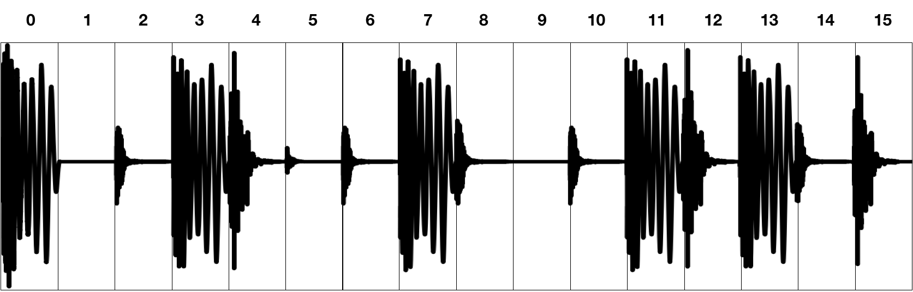

Drysdale, J. and Tomczak, M. and J. Hockman. 2020. Adversarial synthesis of drum sounds. In Proceedings of the 23nd International Conference on Digital Audio Effects, Vienna, Austria. 

Recent advancements in generative audio synthesis have allowed for the development of creative tools for generation and manipulation of audio.
In this project, a strategy is proposed for the synthesis of drum sounds using generative adversarial networks (GANs).
The system is based on a conditional Wasserstein GAN, which learns the underlying probability distribution of a dataset compiled of labeled drum sounds.
Labels are used to condition the system on an integer value that can be used to generate audio with the desired characteristics.
Synthesis is controlled by an input latent vector that enables continuous exploration and interpolation of generated waveforms.

<h3>Audio Examples</h3>

Results accompanying the paper "Adversarial Synthesis of Drum sounds" for the International Conference on Digital Audio Effects 2020.

# 

#### Training Data
A random selection of 30 examples from the dataset used in training.

<figure>
    <figcaption>Kick drums</figcaption>
    <audio controls
		src="./dafx20_audio/real/realkicks.wav">
	</audio>
</figure>

<figure>
    <figcaption>Snare drums</figcaption>
    <audio controls
		src="./dafx20_audio/real/realsnares.wav">
	</audio>
</figure>

<figure>
    <figcaption>Cymbals</figcaption>
    <audio controls
		src="./dafx20_audio/real/realcymbals.wav">
	</audio>
</figure>

#### Generations
A random selection of 30 examples from the generated data.

<figure>
    <figcaption>Kick drums</figcaption>
    <audio controls
		src="./dafx20_audio/gen/genkicks.wav">
	</audio>
</figure>

<figure>
    <figcaption>Snare drums</figcaption>
    <audio controls
		src="./dafx20_audio/gen/gensnares.wav">
	</audio>
</figure>

<figure>
    <figcaption>Cymbals</figcaption>
    <audio controls
		src="./dafx20_audio/gen/gencymbals.wav">
	</audio>
</figure>

#### Usage demonstration

Example usage within loop-based electronic music compositions. 
The percussive elements of the following tracks were created using a selection
of samples from the generated data. A light amount of post-processing (equalisation and volume envelope shaping)
was applied to mix the sounds.

<figure>
    <figcaption>Track 1: Hip hop demo</figcaption>
    <audio controls
		src="./dafx20_audio/track_demos/hiphopdemo.wav">
	</audio>
</figure>

<figure>
    <figcaption>Track 2: Drum and bass demo</figcaption>
    <audio controls
		src="./dafx20_audio/track_demos/drumandbassdemo.wav">
	</audio>
</figure>

##### Generating Drum Loops

Below are some examples of the systems capacity to generate 1 bar loops. A dataset of 130bpm, 1 bar drum loops was complied and then sliced into 16th note segments. The system is conditioned on each of these segments (giving a total of 16 classes) and then trained for a number of iterations. A loop can be created by generating a waveform for each of the 16 classes and then concatentating them together. 

<figure>
    <figcaption>Training loop example 1</figcaption>
    <audio controls
		src="./dafx20_audio/beat_demos/train11.wav">
	</audio>
</figure>

<figure>
    <figcaption>Training loop example 2</figcaption>
    <audio controls
		src="./dafx20_audio/beat_demos/train12.wav">
	</audio>
</figure>

<figure>
    <figcaption>Generated loop example 1</figcaption>
    <audio controls
		src="./dafx20_audio/beat_demos/gen11.wav">
	</audio>
</figure>

<figure>
    <figcaption>Generated loop example 2</figcaption>
    <audio controls
		src="./dafx20_audio/beat_demos/gen12.wav">
	</audio>
</figure>

<figure>
    <figcaption>Interpolating between two different loops</figcaption>
    <audio controls
		src="./dafx20_audio/beat_demos/slerp1.wav">
	</audio>
</figure>

Some more examples can be found here: https://soundcloud.com/beatsbygan

#### Interpolation demonstration

The proposed system learns to map points in the latent space to the generated waveforms. The structure of the latent space can be explored by interpolating between points in the space. For the following experiments, the GAN was trained with a latent space dimensionality of size 3.

Figure 2: Interpolation in the latent space for kick drum generation. Kick drums are generated for each point along linear 
pathsthrough the latent space (left). Paths are colour coded and subsequent generated audio appears across rows (right).

##### A to B interpolation

In the following examples, two generated drum samples are selected and their latent vectors are noted. A linear path of 30 steps between each latent vector is created and a waveform is generated for each of those 30 steps.

Interpolating between Snare A and Snare B.

<figure>
    <figcaption>Snare A</figcaption>
    <audio controls
		src="./dafx20_audio/interpolation_demos/a_b_demos/snare_a.wav">
	</audio>
</figure>
<figure>
    <figcaption>Snare B</figcaption>
    <audio controls
		src="./dafx20_audio/interpolation_demos/a_b_demos/snare_b.wav">
	</audio>
</figure>
<figure>
    <figcaption>Linear interpolation</figcaption>
    <audio controls
		src="./dafx20_audio/interpolation_demos/a_b_demos/demo1_interpolate.wav">
	</audio>
</figure>

Interpolating between Kick A and Kick B.

<figure>
    <figcaption>Kick A</figcaption>
    <audio controls
		src="./dafx20_audio/interpolation_demos/a_b_demos/kick_a.wav">
	</audio>
</figure>
<figure>
    <figcaption>Kick B</figcaption>
    <audio controls
		src="./dafx20_audio/interpolation_demos/a_b_demos/kick_b.wav">
	</audio>
</figure>
<figure>
    <figcaption>Linear interpolation</figcaption>
    <audio controls
		src="./dafx20_audio/interpolation_demos/a_b_demos/demo2_interpolate.wav">
	</audio>
</figure>

Interpolating between Cymbal A and Cymbal B.

<figure>
    <figcaption>Cymbal A</figcaption>
    <audio controls
		src="./dafx20_audio/interpolation_demos/a_b_demos/cymbal_a.wav">
	</audio>
</figure>
<figure>
    <figcaption>Cymbal B</figcaption>
    <audio controls
		src="./dafx20_audio/interpolation_demos/a_b_demos/cymbal_b.wav">
	</audio>
</figure>
<figure>
    <figcaption>Linear interpolation</figcaption>
    <audio controls
		src="./dafx20_audio/interpolation_demos/a_b_demos/demo3_interpolate.wav">
	</audio>
</figure>

###### Linear interpolation

More examples of linear interpolation between two random points.

<figure>
    <figcaption>Kick drums </figcaption>
    
    <audio controls
		src="./dafx20_audio/interpolation_demos/linear_interpolation/kick_1.wav">
		
	</audio>
	
    <audio controls
		src="./dafx20_audio/interpolation_demos/linear_interpolation/kick_2.wav">
		
	</audio>
	
    <audio controls
		src="./dafx20_audio/interpolation_demos/linear_interpolation/kick_3.wav">
		
	</audio>
	
    <audio controls
		src="./dafx20_audio/interpolation_demos/linear_interpolation/kick_4.wav">
		
	</audio>
	

</figure>

<figure>
    <figcaption>Snare drums </figcaption>
    
    <audio controls
		src="./dafx20_audio/interpolation_demos/linear_interpolation/snare_1.wav">
		
	</audio>
	
    <audio controls
		src="./dafx20_audio/interpolation_demos/linear_interpolation/snare_2.wav">
		
	</audio>
	
    <audio controls
		src="./dafx20_audio/interpolation_demos/linear_interpolation/snare_3.wav">
		
	</audio>
	
    <audio controls
		src="./dafx20_audio/interpolation_demos/linear_interpolation/snare_4.wav">
		
	</audio>
	

</figure>

<figure>
    <figcaption>Cymbals </figcaption>
    
    <audio controls
		src="./dafx20_audio/interpolation_demos/linear_interpolation/cymb_1.wav">
		
	</audio>
	
    <audio controls
		src="./dafx20_audio/interpolation_demos/linear_interpolation/cymb_2.wav">
		
	</audio>
	
    <audio controls
		src="./dafx20_audio/interpolation_demos/linear_interpolation/cymb_3.wav">
		
	</audio>
	
    <audio controls
		src="./dafx20_audio/interpolation_demos/linear_interpolation/cymb_4.wav">
		
	</audio>
	
</figure>

###### Spherical interpolation 

Examples of spherical interpolation between two random points.

<figure>
    <figcaption>Kick drums </figcaption>
    
    <audio controls
		src="./dafx20_audio/interpolation_demos/spherical_interpolation/kick_1.wav">
		
	</audio>
	
    <audio controls
		src="./dafx20_audio/interpolation_demos/spherical_interpolation/kick_2.wav">
		
	</audio>
	
    <audio controls
		src="./dafx20_audio/interpolation_demos/spherical_interpolation/kick_3.wav">
		
	</audio>
	
    <audio controls
		src="./dafx20_audio/interpolation_demos/spherical_interpolation/kick_4.wav">
		
	</audio>
	

</figure>

<figure>
    <figcaption>Snare drums </figcaption>
    
    <audio controls
		src="./dafx20_audio/interpolation_demos/spherical_interpolation/snare_1.wav">
		
	</audio>
	
    <audio controls
		src="./dafx20_audio/interpolation_demos/spherical_interpolation/snare_2.wav">
		
	</audio>
	
    <audio controls
		src="./dafx20_audio/interpolation_demos/spherical_interpolation/snare_5.wav">
		
	</audio>
	
    <audio controls
		src="./dafx20_audio/interpolation_demos/spherical_interpolation/snare_4.wav">
		
	</audio>
	

</figure>

<figure>
    <figcaption>Cymbals </figcaption>
    
    <audio controls
		src="./dafx20_audio/interpolation_demos/spherical_interpolation/cymb_1.wav">
		
	</audio>
	
    <audio controls
		src="./dafx20_audio/interpolation_demos/spherical_interpolation/cymb_2.wav">
		
	</audio>
	
    <audio controls
		src="./dafx20_audio/interpolation_demos/spherical_interpolation/cymb_3.wav">
		
	</audio>
	
    <audio controls
		src="./dafx20_audio/interpolation_demos/spherical_interpolation/cymb_4.wav">
		
	</audio>
	
</figure>

 

