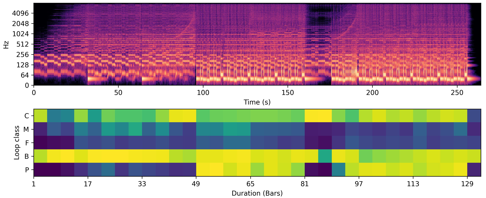

<!--- Drysdale, J. and Ramires, A. and Font, F., Serra, X. and J. Hockman. 2021. Adversarial synthesis of drum sounds. In Proceedings of the 22nd International Society for Music Information Retrieval, Online. -->

<!---####Improved Automatic Instrumentation Role Classification and Structural Analysis for Electronic Music Production -->
<!---
<h3>Improved Automatic Instrumentation Role Classification and Structural Analysis for Electronic Music Production</h3>
-->

<!---[[pdf](https://dafx2020.mdw.ac.at/proceedings/papers/DAFx2020_paper_45.pdf),
[presentation](https://dafx2020.mdw.ac.at/proceedings/presentations/paper_45.mp4)]-->

Modern loop-based electronic music (EM) is created through the activation of short audio recordings of instruments designed for seamless repetition—or loops.
In this work, we aim to label loops into key structural groups such as bass, percussion or melodies by the role they occupy in a piece of music. For this, we use a task called automatic instrumentation role classification (AIRC).

These labels assist EM producers in organizing and identifying compatible loops within large unstructured audio databases. While annotating the audio files by hand is hard work, automatic classification allows for fast and scalable generation of these labels.

In this work, we experimented with several deep-learning architectures and proposed a data augmentation method which allowed us to reach a high-accuracy classification.

Besides the obvious task of classifying instrumentation roles in large collections of loops, we evaluated how our model could be used for identifying the structure of electronic music compositions 
(⚠SPOILER ALERT⚠ You’ll want it on your favourite DJ Software!).

###Analysing the Structure of Loop-based Electronic Music
 

<!---  -->

Our approach to structure analysis with AIRC can be applied to full-length, professionally produced EM, which is something that has yet to be explored in previous literature.
Figure 2 presents an *instrumentation role activation map* (IRAM) of the EM composition 
<a href="https://omunit.bandcamp.com/track/joyspark-bandcamp-exclusive">Joyspark</a> (2020) by Om Unit using our proposed method for loop-based EM structure analysis.
For visualisation and comparison, we show a log-scaled STFT power spectrum of the EM composition above the IRAM.

<!----->

<!---
<Helmet>
<script src='../../class-player.js' />
</Helmet>
-->

<!---

    
    <audio 
            controls 
            src="./Eastern-Kingbird.wav">
    </audio>

-->

The IRAM allows us to visualise activations for each role over the duration of the EM composition, where each square is a measurement of four bars.
Furthermore, we can see how each role develops throughout the EM composition.
For example, the melody role activations progressively increase between bars 1--41, which corresponds with a synthesizer arpeggio that is gradually introduced by automating the cut-off frequency of a low-pass filter. 
Additionally, the chord role activations increase between bars 1--49 in correlation with the chords in this section that gradually increase in volume.
Activations for the percussion role also correlate well with the composition as can be seen between bars 49--81 and 97--129---the only sections that contain percussion. 
Finally, the key structural sections of the composition are easily identifiable.
For example, the introduction to the composition (bars 1--49) begins relatively sparse in the composition and IRAM; whereas, bars 49--81 and 97--129 are quite clearly the *core* of the piece---that is, the most energetic sections of the composition typically established by the *drop*.

